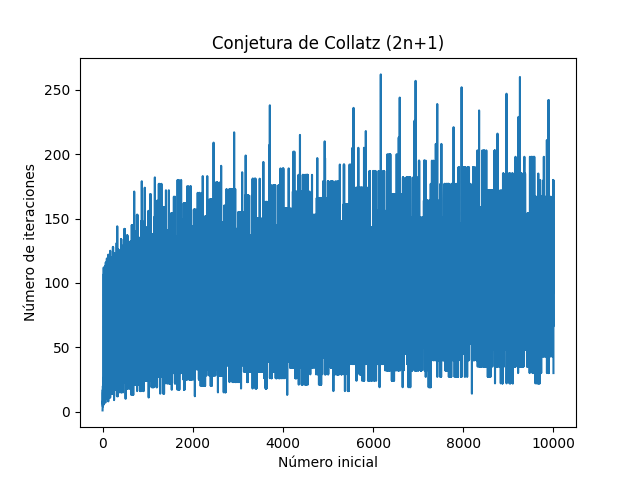

# UADER_IS2_ENZO_ETCHETO

## Listas 

### Lista ordenada

lista1 = [item1,item2,item3]
lista1.sort()

lista2 = [item5,item6,item7]
lista2.sort()

### Lista enumerada 

listaE = [Juan, pedro, carlos, alex] 
listaenumerada = enumerate(listaE)
for indice, nombre in lista_enumerada:
    print(f"{indice + 1}. {nombre}")

## Figura de Collatz

## Referencia
https://es.wikipedia.org/wiki/Conjetura_de_Collatz

